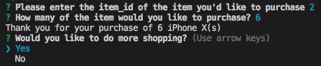

Welcome to the Bamazon Marketplace CLI! Please follow the instructions below to first install and then utilize both BamazonCustomer and Bamazon ManagerView.

Install App:
1. Initialize app by opening folder in terminal and typing the following command and pressing enter:
    npm init
2. Install the mysql, inquirer, and console.table dependencies using the following command and pressing enter:
    npm install
3. Check for a node_modules folder to make sure dependencies were properly installed.

Create database on computer:

Included in the Bamazon folder is a file named bamazon_setup.sql. This file can be used to create the database necessary for this app to function correctly.
1. Using your favorite MySQL application, open the bamazon_setup.sql file.
2. Run the code inside the file to create the database!
Youre database should contain a table that looks like this: 

Congrats! You're now ready to use the app!

Using Bamazon Customer:

1. Make sure the Bamazon folder is open in Terminal,
2. Run the app by typing the following command and pressing enter:
    node bamazonCustomer.js
3. You will be shown the following screen:

4. Follow the prompts to "complete your purchase"

5. Answer the prompted question. Selecting "yes" will restart the app. Selecting "no" will quit the app.