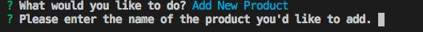

Welcome to the Bamazon Marketplace CLI! Please follow the instructions below to first install and then utilize both BamazonCustomer and Bamazon ManagerView.

Install App:
1. Initialize app by opening folder in terminal and typing the following command and pressing enter:
    npm init
2. Install the mysql, inquirer, and console.table dependencies using the following command and pressing enter:
    npm install
3. Check for a node_modules folder to make sure dependencies were properly installed.

Create database on computer:

Included in the Bamazon folder is a file named bamazon_setup.sql. This file can be used to create the database necessary for this app to function correctly.
1. Using your favorite MySQL application, open the bamazon_setup.sql file.
2. Run the code inside the file to create the database!
Youre database should contain a table that looks like this: 

Congrats! You're now ready to use the app!

Using Bamazon Customer:

1. Make sure the Bamazon folder is open in Terminal,
2. Run the app by typing the following command and pressing enter:
    node bamazonCustomer.js
3. You will be shown the following screen:                      

4. Follow the prompts to "complete your purchase"

5. Answer the prompted question. Selecting "yes" will restart the app. Selecting "no" will quit the app.

Using Bamazon ManagerView:

1. Make sure the Bamazon folder is open in Terminal,
2. Run the app by typing the following command and pressing enter:
    node bamazonManager.js
3. You will be shown the following screen:  

4. Select one of the options.

Selecting "View Products for Sale"
1. You will be shown this screen showing all the products available for sale:       

2. Answer the prompted question. Selecting "yes" will ask you to choose a new action. Selecting "no" will quit the app.

Selecting "View Low Inventory"
1. You will be shown all of the products for which less than 5 of that item are left in inventory. If nothing is displayed (like shown), all products have an inventory greater than 5.

2. Answer the prompted question. Selecting "yes" will ask you to choose a new action. Selecting "no" will quit the app.

Selecting "Add to Inventory"
This function allows you to add inventory to a specific product.
1. You will be shown the following screen:            

2. Follow the prompts to add inventory. You will see this screen when you've successfully added inventory:

3. Answer the prompted question. Selecting "yes" will ask you to choose a new action. Selecting "no" will quit the app.

Selecting "Add New Product"
This function adds a new product to the store.
1. You will be shown the following screen:            

2. Enter the details of the product by answering the questions you are prompted with.
3. When you have finished adding details, you will see this screen, indicating you have added a new product successfully:

4. Answer the prompted question. Selecting "yes" will ask you to choose a new action. Selecting "no" will quit the app.

